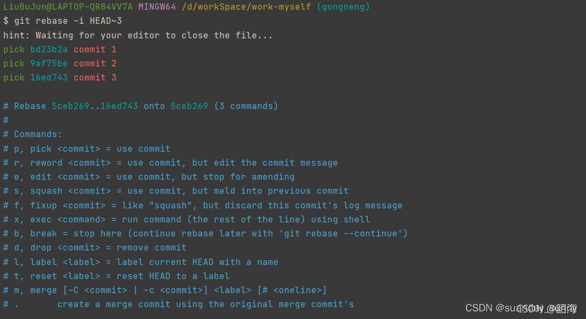
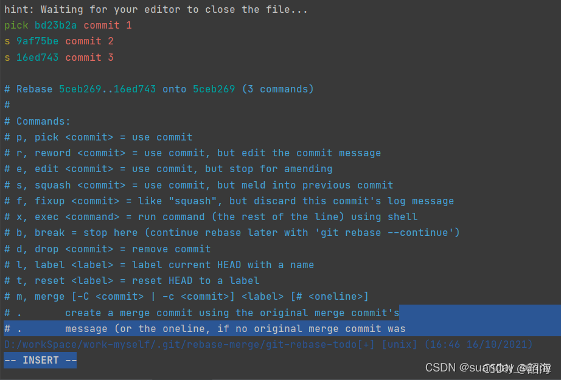
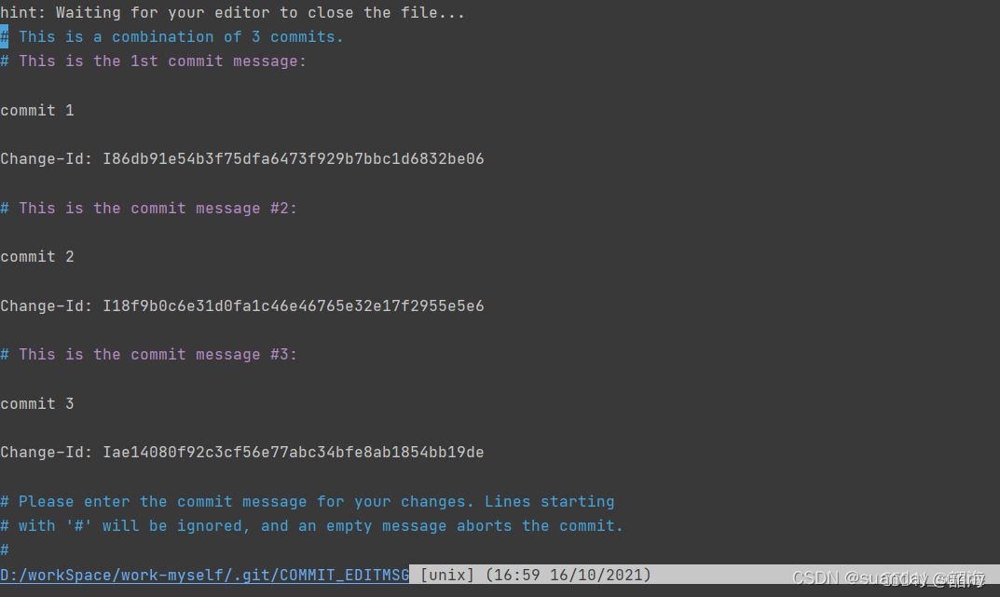
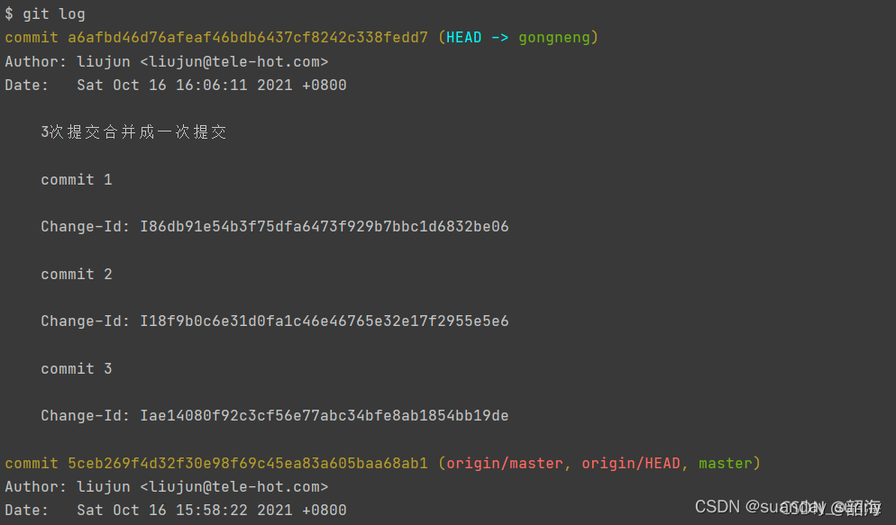

### 查看log 
git log

### 合并前三次
git rebase -i HEAD~3

### 保留3
pick：保留该commit
squash：将该commit和前一个commit合并
故如果我们想要将此3次提价合并成一个提交，需要将commit2和commit3的pick改成squnsh(缩写“s”)也可。如下图：

### 编辑提交信息。wq保存退出

###  再次查看记录（命令：git log）

### 强制推送到远程（命令：git push -f） ；没有与远端建立连接 所以需要执行 git push -f --set-upstream origin gongneng 

