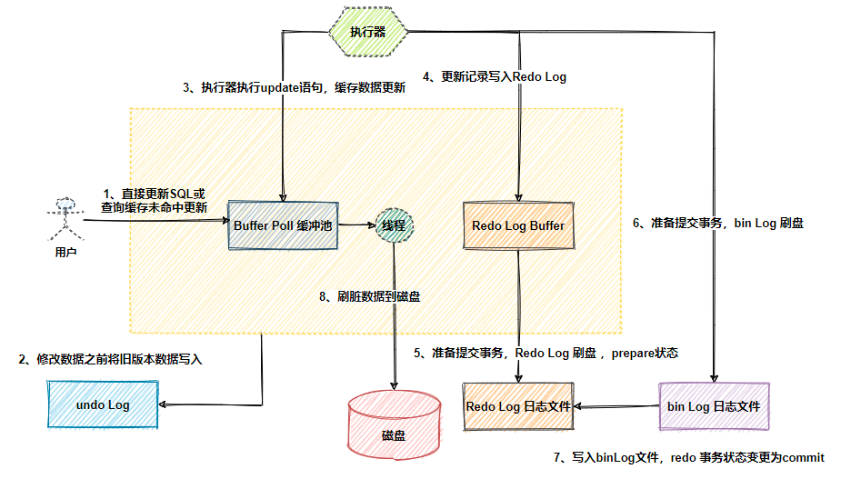

架构-DDD
项目 -有亮点，技术复杂度-反思-做更好
基础知识-----gmp -chanel -gc
1.生产者消费者模型
kafka
redis ---跳表
力扣---简单---中等

方案-方向
    方案-技术思考 机构设计 技术方案决策  技术管理


要有调理，前因后果

ES   索引结构，索引流程-    存储原理

项目经验-重要的放前面


技术栈-- 不限制
医疗

springboot alibaba docker


    select lock in share mode（共享锁）
    select for update（排他锁）
    update（排他锁）
    insert（排他锁）
    delete（排他锁）

## mysql
- mysq底层执行顺序
   
   
   

- mysql
- 集群搭建的方式
- 分库分表策略
- 回表
- 分页
  - 事务
      - 四个隔离级别
          1. Read Uncommited(RU)： 读未提交，一个事务可以读到另一个事务未提交的数据！
          2. Read Committed (RC)： 读已提交，一个事务可以读到另一个事务已提交的数据!
          3. Repeatable Read (RR): 可重复读，加入间隙锁，一定程度上避免了幻读的产生！注意了，只是一定程度上!
          4. Serializable： 串行化，该级别下读写串行化，且所有的select语句后都自动加上lock in share mode，即使用了共享锁。因此在该隔离级别下，使用的是当前读，而不是快照读。
      - 事务包含四大特性，即原子性（Atomicity）、一致性（Consistency）、隔离性（Isolation）和持久性（Durability）(ACID)。
           1. 原子性（Atomicity） 原子性是指对数据库的一系列操作，要么全部成功，要么全部失败，不可能出现部分成功的情况。以转账场景为例，一个账户的余额减少，另一个账户的余额增加，这两个操作一定是同时成功或者同时失败的。
           2. 一致性（Consistency） 一致性是指数据库的完整性约束没有被破坏，在事务执行前后都是合法的数据状态。这里的一致可以表示数据库自身的约束没有被破坏，比如某些字段的唯一性约束、字段长度约束等等；还可以表示各种实际场景下的业务约束，比如上面转账操作，一个账户减少的金额和另一个账户增加的金额一定是一样的。
           3. 隔离性（Isolation） 隔离性指的是多个事务彼此之间是完全隔离、互不干扰的。隔离性的最终目的也是为了保证一致性。
           4. 持久性（Durability） 持久性是指只要事务提交成功，那么对数据库做的修改就被永久保存下来了，不可能因为任何原因再回到原来的状态。
       
- 索引
- mysql-三大日志binlog、redoLog、undoLog
    1. binlog 是作为mysql操作记录归档的日志，这个日志记录了所有对数据库的数据、表结构、索引等等变更的操作,binlog用于记录数据库执行的写入性操作(不包括查询)信息，
        以二进制的形式保存在磁盘中。binlog是mysql的逻辑日志，并且由Server层进行记录，使用任何存储引擎的mysql数据库都会记录binlog日志。
        ，binlog的主要使用场景有两个，分别是主从复制和数据恢复。
    2. Redo log也称事务日志，由InnoDB存储引擎产生，记录了此次事务「完成后」的数据状态，记录的是更新之后的「后」的值。
        Redo Log的主要解决两方面问题：
         - 保证数据库的持久性，覆盖数据库宕机场景下未保存的数据和未写入磁盘的脏页恢复。
           - 将更新数据先记录在内存中，InnoDB 引擎会在适当的时候，将这个操作记录更新到磁盘里面。将随机数据页改成顺序IO，提升数据库性能。
    3. 两阶段提交
     为了保持日志的一致性，MySQL采用了两阶段提交（2PC）。步骤近似如下
     - 当数据操作完毕且结果写入内存后，写入redo log 并且将事务状态设置为 prepare
     - 写入server层bin log
     - binlog写入成功后，将redo log设置为commit
     4. Redo Log和 binLog 如何关联？
      通过共同数据字段 XID。崩溃恢复的时候，会按顺序扫描 redo log：
      - 碰到既有 prepare、又有 commit 的 redo log，就直接提交
      - 碰到只有 parepare、没有 commit 的 redo log，会根据 XID 去 binlog 查找对应的事务
     5. undo log设计目标
        1.redo log 是也属于引擎层(innodb)的日志，从上面的redo log介绍中我们就已经知道了，redo log 和undo log的核心是为了保证innodb事务机制中的持久性和原子性，
         事务提交成功由redo log保证数据持久性，而事务可以进行回滚从而保证事务操作原子性则是通过undo log 来保证的。
         undo log记录内容
        2.在Mysql里数据每次修改前，都首先会把修改之前的数据作为历史保存一份到undo log里面的，数据里面会记录操作该数据的事务ID，然后我们可以通过事务ID来对数据进行回滚。
- MVCC
 MVCC即多版本并发控制，MVCC是一种并发控制的方法，一般在数据库管理系统中，实现对数据库的并发访问，在编程语言中实现事务内存。
 MVCC在MySQL InnoDB中的实现主要是为了提高数据库的并发性能，用更好的方式去处理读-写冲突，做到==即使有读写冲突时，也能做到不加锁，非阻塞并发读==。
  ```
  引入多版本之后，只有写写之间相互阻塞，其他三种操作都可以并行，这样大幅度提高了InnoDB的并发度。
  在内部实现中，与Postgres在数据行上实现多版本不同，InnoDB是在undolog中实现的，通过undolog可以找回数据的历史版本。
  找回的数据历史版本可以提供给用户读(按照隔离级别的定义，有些读请求只能看到比较老的数据版本)，也可以在回滚的时候覆盖数据页上的数据。
  在InnoDB内部中，会记录一个全局的活跃读写事务数组，其主要用来判断事务的可见性。
  ```
- 什么是当前读和快照读
1.当前读
就像 select lock in share mode（共享锁），select for update；update，insert，delete（排他锁）；这些操作都是一种当前读，
为什么叫当前读？因为它读取的记录都是目前数据库中最新的版本，读取时还要保证其它并发事务不能修改当前记录，所以会对读取数据加锁。
2.快照读
像不加锁的select操作就是快照读，即不加锁的非阻塞读，快照读的前提是隔离级别不是串行级别，串行级别下的快照读会退化成当前读。
快照读的实现是基于多版本并发控制(MVCC)。

### MVCC的实现
1.回顾事务的特性

    原子性：通过undolog实现。
    持久性：通过redolog实现。
    隔离性：通过加锁（当前读）&MVCC（快照读）实现。
    一致性：通过undolog、redolog、隔离性共同实现。

2.回顾事务的隔离级别

    读未提交：允许读取尚未提交的数据变更。可能会导致脏读、幻读或不可重复读。
    读已提交：允许读取已经提交的数据。可能会导致幻读和不可重复读。
    可重复读：对同一字段的多次读取结果都是一致的，除非数据是被本身事务自己所修改。可能会导致幻读。
    可串行化：最高隔离级别。
    https://blog.csdn.net/lans_g/article/details/124232192
### mysql 树形表
##### 预排序树


## Redis
   1. 单线程为什么快
     
     Redis 内部使用文件事件处理器 file event handler ，这个文件事件处理器是单线程的，
     所以才称Redis为单线程模型。它采用 IO 多路复用机制同时监听多个 socket，
     将产生事件的 socket 压入内存队列中，事件分派器根据 socket 上的事件类型来选择对应的事件处理器进行处理。
     Redis的单线程模型避免了线程切换和锁竞争的开销，并且Redis是内存数据库，这两者奠定了Redis高性能的基础。
   2. 缓存雪崩、缓存穿透、缓存预热、缓存更新、缓存降级
   3. Redis的各种集群方案、及优缺点对比
     主从，哨兵，Codis代理，RC（Redis Cluster）模式，Alchemy
     Redis是一个支持高可用性的分布式缓存，故支持集群特性。Redis的集群分为三种模式，分别是主从模式，Sentinel模式和Cluster模式。
   https://blog.csdn.net/fengyuyeguirenenen/article/details/123426864
   4. redis HA 持久化 RDB和AOF持久化
   5redis LRU 内存失效算法

## ES
- 正排索引
  正排索引就是文档(Document) 和它的字段(Field)的对应关系
- 倒排索引
  倒排索引是字段Field和拥有这个Field的文档对应的关系:
  ES基于Lucene引擎，Lucene的索引结构不是B+树，而是倒排索引，Lucene的倒排索引由Term Index，Term Dictionary 和 Posting List组成
   
  Posting List:文档id
  Term Dictionary:对term排序，二分查找，组织的结构。
    
  Term Index：term index是一棵trie 树（FST），因为Term Dictionary很大无法完全放在内存就有了Term Index。term前缀组成。
  

- es为什么高性能
 

## RocketMQ
集群部署方式：
1.单master模式，2.多master模式，3多master多slave 异步复制模式，4多master多slave 同步复制
如何保证消息不丢失：确认模式
## kafka


## devops
https://zhuanlan.zhihu.com/p/420977457


## React


## 代码
```
qweqwe
```


G1 收集过程
1.初始化标记：主要是标记和GC root能直接关联的对象。
2.并发标记：从GC root开始对对象进行可达性分析，递归查找存活对象，并发执行
3.最终标记：对用户线程做短暂暂停，对于并发阶段遗漏的进行标记。
4.筛选回收：负责region的统计，对各个region的回收价值和成本进行排序，，根据用户期望的停顿时间指定垃圾回收计划。

spring bean 生命周期
1.实例化
2.属性赋值
3.初始化
4.销毁

1.出问题
2.pc
3.qq


## Java 中 3 种常见 IO 模型
1.BIO 属于同步阻塞 IO 模型 。
同步阻塞 IO 模型中，应用程序发起 read 调用后，会一直阻塞，直到内核把数据拷贝到用户空间。
2.NIO (Non-blocking/New I/O)
Java 中的 NIO 可以看作是 I/O 多路复用模型。也有很多人认为，Java 中的 NIO 属于同步非阻塞 IO 模型。
3.AIO (Asynchronous I/O)
AIO 也就是 NIO 2。Java 7 中引入了 NIO 的改进版 NIO 2,它是异步 IO 模型。
异步 IO 是基于事件和回调机制实现的，也就是应用操作之后会直接返回，不会堵塞在那里，当后台处理完成，操作系统会通知相应的线程进行后续的操作。


## JVM
### class包含内容
```
class文件组成包括magic（魔数），
minor_version(副版本号)，
major_version(正版本号)，
constant_pool_count(常量池计数器)，
access_flags(访问标记)，
this_class(类索引)，
super_class(父类索引)，
interfaces_count(接口数量)，
interfaces（接口数组),
fields(字段表)，
methods_count(方法数量)，
methods（方法表），
attributes_count(属性数量)，
```

attributes（属性表）；
### 线程私有
1.虚拟机栈：Java 虚拟机栈（后文简称栈）也是线程私有的，它的生命周期和线程相同，随着线程的创建而创建，随着线程的死亡而死亡。
- 局部变量表:主要存放编译期可知的各种数据类型，对象引用。
 - 操作数栈：主要作为方法调用的中转站使用，用于存放方法执行过程中产生的中间计算结果。另外，计算过程中产生的临时变量也会放在操作数栈中
 - 动态链接：动态链接的作用就是为了将符号引用转换为调用方法的直接引用。
 - 方法返回地址：即调用该方法的指令的下一条指令的地址
2.本地方法栈： 虚拟机栈为虚拟机执行 Java 方法 （也就是字节码）服务，而本地方法栈则为虚拟机使用到的 Native 方法服务。
3.程序计数器：是一块较小的内存空间，可以看做是当前线程所执行字节码的行号指示器。

### 线程共享
1.堆：Java 虚拟机所管理的内存中最大的一块，Java 堆是所有线程共享的一块内存区域，
在虚拟机启动时创建。此内存区域的唯一目的就是存放对象实例，几乎所有的对象实例以及数组都在这里分配内存。
Eden、Survivor、Old
2.方法区（元空间）：方法区属于是 JVM 运行时数据区域的一块逻辑区域，是各个线程共享的内存区域。
``` 
-XX:MetaspaceSize=N //设置 Metaspace 的初始（和最小大小）
-XX:MaxMetaspaceSize=N //设置 Metaspace 的最大大小
```

`
3.直接内存

### 对象包含内容
	普通对象
		 对象头：Markword，占8字节,对象的MarkWord一般占8字节，MarkWord的2位来表示锁的状态，分代年龄也在MarkWord里，表明这个对象被GC回收了多少次
        + UseCompressedClassPointers和+ UserCompressedOops，这2个参数是JVM默认开启的
        UseCompressedClassPointers会把_class pointer从8字节压缩到4字节


		 指针：ClassPointer
			 指针压缩后为4字节，不压缩为8字节，默认开启压缩
			 ClassPointers：指的是类对象的指针，也就是实例对象的指针压缩
			 完整参数：-XX:+UseCompressedClassPointers
		 实例数据：成员变量
			 成员变量的指针压缩后为4字节，不压缩为8字节，默认开启压缩
			 Oops：ordinary object pointers，代表的是普通对象指针，也就是成员变量的指针压缩
			 完整参数：-XX:UseCompressedOops
		 8字节对齐：Padding，因为内存是按照块来划分的，为了加快读写效率，所以对象的大小必须是8的倍数
	○ 数组对象
		 相对与普通对象，多了一个数组长度，大小为4字节
	○ hotspot压缩规则
		 4G以下，直接砍掉高32位
		 4G-32G，默认开启内存压缩ClassPointers和Oops
		 32G以上，压缩无效，直接使用64位，所以内存不是越大越好
		 new Object在内存中，占16字节
		 new空数组在内存中占16字节，如果不开启指针压缩的话是24字节

## Nginx
通过nginx代理服务器，可以对后端的具体应用实现反向代理或负载均衡等功能，并且nginx可以对应用进行健康检查，将故障节点从负载均衡池中排出，从而实现对后端应用的高可用性保障。
集群：主备，主主
高可用： 
 - haproxy+nginx:haproxy 可以提供高可用性、负载均衡以及基于 TCP 和 HTTP 应用的代理，并且支持虚拟主机配置,可配置重启nginx
 - keeplived+nginx：keepalived组件；对外提供服务的虚拟IP地址。
 - keepalived组件+haproxy+nginx:


## java 线上排查
1. top
2. top -Hp 13731    //获取进程下的线程
3. printf "%x\n" 2310   //把10进制的线程id转成16进制
4. jstack  13731 > thread_stack.log    //13731：线程id


## 问题：
- 我们要面向的核心用户群是谁？
- 用户原始需求是什么？最核心问题是哪几个？已经有哪些玩家在里面？
- 上下游有哪些类型的团队/系统，在我们之前，用户是怎么解决他们的问题的？我们的替换方案又是怎样的？
- 我们的产品创造的价值点是什么？用户最关注的核心指标是什么？
- 用户需求潜在的变化在哪些地方？区分出需求的变化点和稳定点。